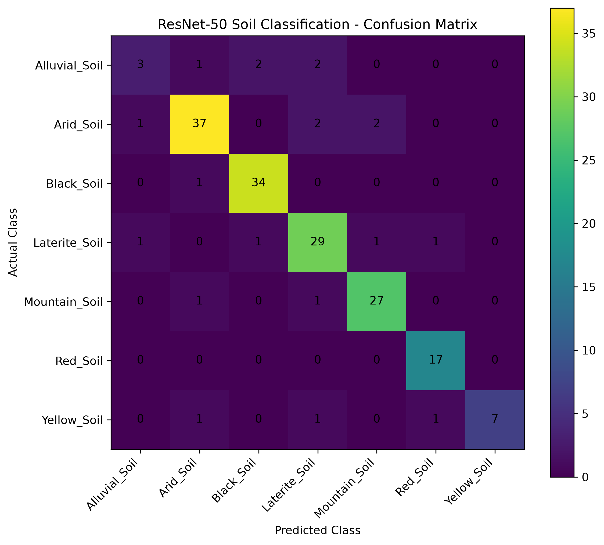
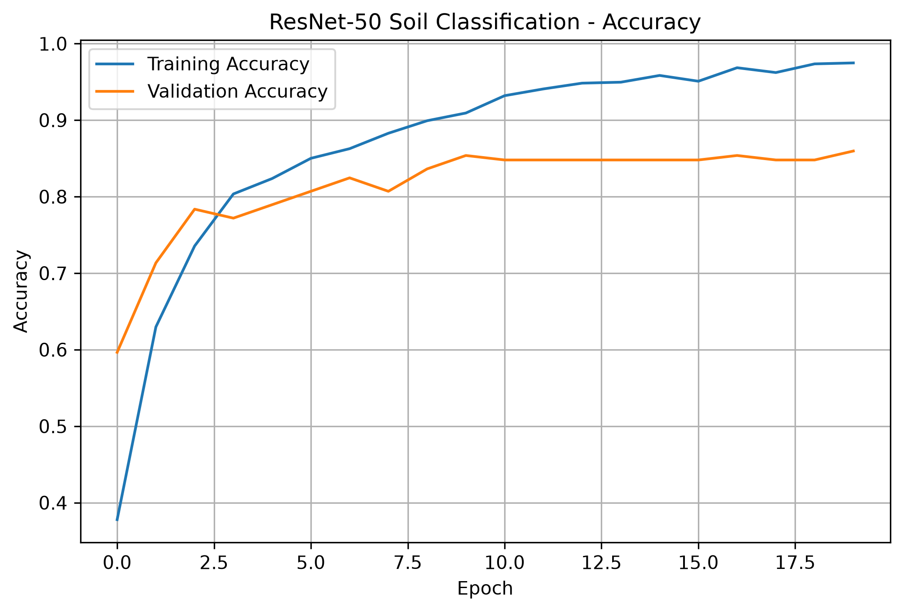
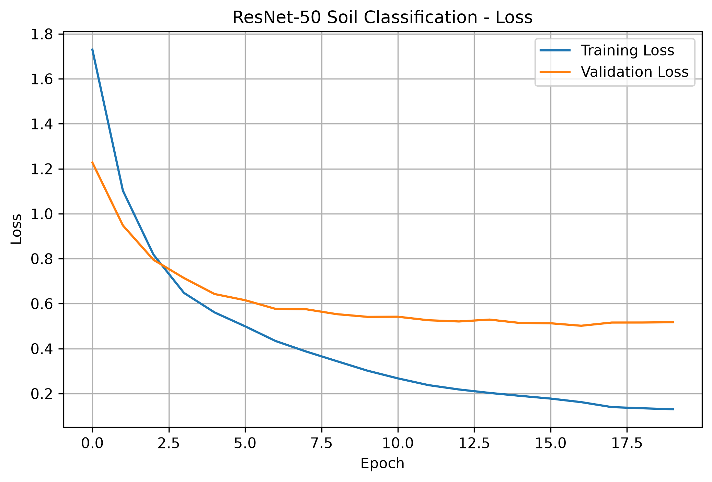

# Week 3 — CNN Soil Image Analysis Evaluation Report

## 1. Objective

Develop a CNN-based soil image classification system using transfer learning
with the selected ResNet-50 architecture.

## 2. Dataset

- Training images: 794
- Validation images: 171
- Test images: 174
- Total images: 1,139
- Number of soil classes: 7

### Soil Classes

1. Alluvial Soil
2. Arid Soil
3. Black Soil
4. Laterite Soil
5. Mountain Soil
6. Red Soil
7. Yellow Soil

## 3. CNN Model

### Architecture

- Base model: ResNet-50
- Pretrained weights: ImageNet
- Pretrained layers: Frozen
- Global Average Pooling: Yes
- Dropout: 0.3
- Final classification layer: Dense
- Number of output classes: 7
- Activation: Softmax

### Transfer Learning Configuration

The pretrained ResNet-50 network was used as a frozen feature extractor.
Each image was converted into a 2,048-dimensional feature representation.

A lightweight classifier was trained on these extracted features.

## 4. Training Configuration

- Image size: 224 × 224
- Batch size: 8 for image processing
- Classifier epochs: 20
- Optimizer: Adam
- Learning rate: 0.0001
- Loss function: Sparse Categorical Crossentropy

## 5. Training Results

- Final training accuracy: 0.9748 (97.48%)
- Final validation accuracy: 0.8596 (85.96%)
- Final training loss: 0.1304
- Final validation loss: 0.5174
- Best validation epoch: 20
- Best validation accuracy: 0.8596 (85.96%)

## 6. Test Set Evaluation

- Test accuracy: 0.8851 (88.51%)
- Weighted precision: 0.8823 (88.23%)
- Weighted recall: 0.8851 (88.51%)
- Weighted F1-score: 0.8803 (88.03%)

## 7. Class-wise Performance

| Class | Precision | Recall | F1-score | Support |
|---|---:|---:|---:|---:|
| Alluvial_Soil | 0.60 | 0.38 | 0.46 | 8 |
| Arid_Soil | 0.90 | 0.88 | 0.89 | 42 |
| Black_Soil | 0.92 | 0.97 | 0.94 | 35 |
| Laterite_Soil | 0.83 | 0.88 | 0.85 | 33 |
| Mountain_Soil | 0.90 | 0.93 | 0.92 | 29 |
| Red_Soil | 0.89 | 1.00 | 0.94 | 17 |
| Yellow_Soil | 1.00 | 0.70 | 0.82 | 10 |

## 8. Confusion Matrix

The confusion matrix was generated to identify correct and incorrect
classification patterns across the seven soil classes.

## 9. Incorrect Prediction Analysis

Total test images: 174

Correct predictions: 154

Incorrect predictions: 20

The largest classification difficulty was observed for Alluvial Soil,
where 3 of 8 test samples were correctly classified.

Red Soil achieved 17 of 17 correct predictions in the test set.

The detailed incorrect-prediction information, including prediction
confidence, was recorded during the analysis.

## 10. Overfitting / Generalization Observation

Training accuracy reached 97.48%, while validation
accuracy reached 85.96%.

The difference indicates some degree of overfitting. However, the validation
accuracy continued improving through the final training epoch, and the
independent test accuracy was 88.51%.

## 11. Training Curves

### Accuracy

### Loss

## 12. Model File

The trained classifier was saved as:

`models/cnn/resnet50_soil_classifier.keras`

## 13. Conclusion

The ResNet-50 transfer-learning pipeline successfully classified the seven
soil-image classes and achieved an overall test accuracy of
88.51% with a weighted F1-score of 88.03%.

The model and evaluation outputs are ready for inclusion in the Week 3
CNN soil image analysis deliverable.
